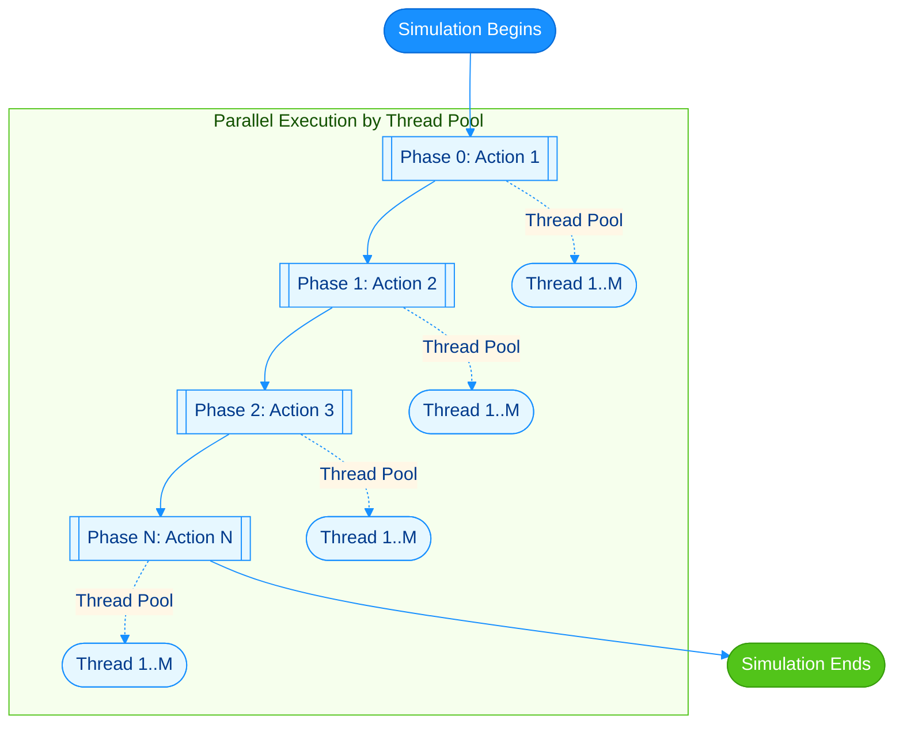

# 🧬 Multi-threads Agent-based Simulation Framework

## 📋 Project Introduction
This is a multi-threaded Agent-Based Model framework designed for simulating complex systems such as disease transmission and information diffusion in social networks. Developed using Repast Simphony, the model efficiently handles dynamic interactions in large-scale agent populations through parallel computing technology.

## ✨Key Advantages 
- Phase-based parallel execution of agent behaviors for improved efficiency
- Supports loading network data from external files for flexible topology construction
- Annotation-based behavior scheduling for simplified extension
- Thread-safe design ensuring consistency in multi-phase computations
## 🏗️Framework Structure 

## 🧩Core Components
| Component Name               | Package             | Core Responsibility                                                                 |
|------------------------------|------------------------------|--------------------------------------------------------------------------------------|
| Agent                        | model                         | Represents individual entities in disease transmission simulation, achieves phase-based execution through annotation coordination with multi-thread scheduling.|
| Monitor                      | model                         | Tracks simulation progress in real-time, collects key metrics, provides interfaces to access these statistics. |
| ModelContextBuilder          | model                         | Acts as the model initialization entry point, coordinating component creation, configuration loading, and network setup. |
| AgentManager                 | multithread                   | Manages multi-threaded execution, controls phase-based scheduling of agent behaviors, and handles thread pool synchronization. |
| @ThreadScheduledMethod       | multithread                   | Marks methods to be executed in specific simulation phases (e.g., decision or interaction phases) for parallel processing. |
| @ThreadScheduledField        | multithread                   | Annotates boolean fields that control whether an agent participates in specific simulation phases. |
| DataLoader                   | networkDataLoader             | Loads and parses edge list files into structured edge maps, handles invalid entries/comments, and calculates total nodes and network statistics. |
| CustomizedNetworkGenerator   | networkCreator                | Generates network topology using parsed edge maps, creates edges between nodes in the Repast Simphony framework, and supports directed networks with optional symmetrical edges. |

### ⚙️ Phase Annotation System 
The annotation-driven phase control system enables declarative scheduling of agent behaviors in multi-phase simulations. The framework consists of two complementary annotations:

```java
// Field annotation: Controls agent participation in specific phases
@Target(ElementType.FIELD)
@Retention(RetentionPolicy.RUNTIME)
public @interface ThreadScheduledField {
    int phase(); // Specifies the associated phase number
}

// Method annotation: Marks methods to be executed in specific phases
@Target(ElementType.METHOD)
@Retention(RetentionPolicy.RUNTIME)
public @interface ThreadScheduledMethod {
    int phase(); // Specifies the execution phase number
}
```
### ⚙️ Phase Execution Engine (AgentManager)
The AgentManager coordinates phase execution, leveraging thread pools for parallelism while maintaining phase order:
```java
public class AgentManager<T> {

    private Field[] phaseFields; 
    private Method[] phaseMethods; 
    
    public void step() {
        for (int phase = 0; phase < MAX_PHASES; phase++) {
            if (phaseMethods[phase] == null) continue;
            
            ExecutorService pool = Executors.newFixedThreadPool(numThread);
            for (T agent : agents) {
                if (phaseFields[phase].getBoolean(agent)) {
                    pool.submit(new AgentRunnable(agent, phaseMethods[phase]));
                }
            }
            pool.shutdown();
            while (!pool.isTerminated()); 
        }
    }
}
```

### ⚙️ Agent Implementation
Agents define phase-specific behaviors using the annotation system, with boolean fields controlling participation:
```java
public class Agent {
    // Phase 0: 
    @ThreadScheduledField(phase = 0)
    private boolean shouldAction1 = true;
    
    // Phase 0: 
    @ThreadScheduledMethod(phase = 0)
    public void action1() {

    }
    
    // Phase 1: 
    @ThreadScheduledField(phase = 1)
    private boolean shouldAction2 = true;
    
    // Phase 1: 
    @ThreadScheduledMethod(phase = 1)
    public void action2() {

    }
    
    // Phase 2: 
    @ThreadScheduledField(phase = 2)
    private boolean shouldAction3 = true;
    
    // Phase 2: 
    @ThreadScheduledMethod(phase = 2)
    public void action3() {

    }
}
```
